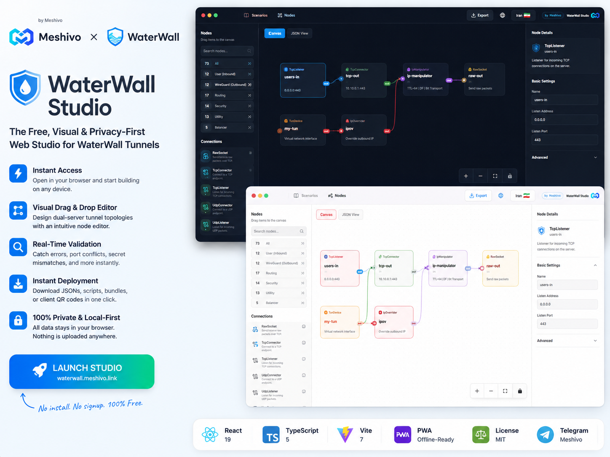

<div align="center">

  <p>
    
    &nbsp;&nbsp;×&nbsp;&nbsp;
    
  </p>

  <h1>🛡️ WaterWall Studio</h1>

  <p>
    <strong>The Free, Visual & Privacy-First Web Studio for WaterWall Tunnels</strong>
  </p>

  <p>
    <a href="https://waterwall.meshivo.link" target="_blank">
      
    </a>
  </p>

  <p>
    
    
    
    
    
    <a href="https://t.me/Meshivo" target="_blank">
      
    </a>
  </p>

  <p>
    <a href="#english"><b>🇬🇧 English</b></a>
    &nbsp;&bull;&nbsp;
    <a href="#فارسی"><b>🇮🇷 فارسی</b></a>
  </p>

  <p>
    🌐 <a href="https://waterwall.meshivo.link" target="_blank"><b>Launch Studio</b></a> &nbsp;|&nbsp;
    🔗 <a href="https://meshivo.link" target="_blank"><b>Website</b></a> &nbsp;|&nbsp;
    🐙 <a href="https://github.com/Meshivo" target="_blank"><b>GitHub</b></a> &nbsp;|&nbsp;
    📢 <a href="https://t.me/Meshivo" target="_blank"><b>Telegram</b></a> &nbsp;|&nbsp;
    ✉️ <a href="mailto:meshivo@proton.me"><b>Email</b></a>
  </p>

</div>

---

<p align="center">
  <a href="https://waterwall.meshivo.link" target="_blank">
    
  </a>
</p>

---

<div align="left">

<h1 id="english">🇬🇧 WaterWall Studio (Web Service)</h1>

> 🚀 **Free Web Application:** Access the live studio instantly at **[waterwall.meshivo.link](https://waterwall.meshivo.link)** — No installation, zero setup, no registration, and 100% private in-browser execution.

---

## 📖 What is WaterWall Studio?

**WaterWall Studio** is a visual web application that simplifies designing and configuring [WaterWall](https://github.com/radkesvat/WaterWall) proxy tunnels. Instead of manually editing complex JSON files, you can visually build, validate, and export full deployment-ready server configurations directly from your web browser.

> ⚠️ **Notice:** WaterWall Studio is created by [Meshivo](https://meshivo.link). It is an independent project and is not officially affiliated with or endorsed by the official WaterWall team.

---

## ⚡ Why Use the Web Studio?

* 🚀 **Instant Access:** Open **[waterwall.meshivo.link](https://waterwall.meshivo.link)** and start building immediately on any device.
* 🎨 **Visual Drag & Drop Editor:** Design dual-server tunnel topologies (Iran & Foreign) using intuitive node cards powered by React Flow.
* 🔍 **Real-Time Validation:** Catch configuration errors, port collisions, secret mismatches, and layer errors before touching your servers.
* 📦 **Instant Deployment Bundles:** Download production-ready JSONs, installer scripts, ZIP bundles, or client QR codes with a single click.
* 🔒 **100% Private & Local-First:** All processing and data storage stay in your browser. Nothing is sent to any backend server.

### ✨ More Capabilities

* **70+ WaterWall nodes** with search, categories, field descriptions, and compatible connection suggestions.
* **Separate Iran and Foreign canvases** with automatic layout, undo, redo, zoom, and multiple themes.
* **Guided scenarios** for quickly creating complete two-server configurations.
* **Layer-aware and cross-server validation** for ports, secrets, protocols, counterparts, timeouts, and incomplete references.
* **Flexible import and export:** single-server JSON, full Studio projects, live JSON editing, ZIP deployment bundles, reports, client links, and QR codes.
* **Traffic-flow simulation**, automatic browser storage, responsive layout, and offline PWA support.

---

## 🔒 Privacy & Security

> 🟢 **Zero Data Collection:**
> WaterWall Studio runs entirely on your client machine inside your web browser. Your server IPs, secrets, and tunnel configurations are never uploaded, logged, or transmitted anywhere.

---

## 🛠️ For Developers: Self-Hosting & Local Setup

If you prefer to run or build the application locally from source:

```bash
# Clone the repository
git clone https://github.com/Meshivo/waterwall-studio.git
cd waterwall-studio

# Install dependencies & run development server
npm install
npm run dev

# Quality assurance
npm test         # Unit tests (Vitest)
npm run test:e2e # End-to-end tests (Playwright)
npm run build    # Build production bundle
```

---

## 🤝 Contributing

Contributions, bug reports, and feature requests are welcome:

1. Open an issue for a bug, suggestion, or major change.
2. Fork the repository and create a focused branch.
3. Run `npm test`, `npm run lint`, and `npm run build`.
4. Submit a pull request explaining the change and its purpose.

Include reproduction steps for bugs and screenshots for visual changes. Never publish real server addresses, credentials, secrets, or private configurations.

## 📚 Credits & License

WaterWall Studio uses concepts and node definitions from [WaterWall](https://github.com/radkesvat/WaterWall) and [React Flow](https://reactflow.dev/) for its visual editor. WaterWall remains under MPL-2.0 and React Flow remains under MIT.

WaterWall Studio is released under the MIT License.

---

</div>

---

<div dir="rtl" align="right">

<h1 id="فارسی">🇮🇷 استودیوی آنلاین WaterWall</h1>

> ⚡ **سرویس ۱۰۰٪ رایگان و آنلاین:** می‌توانید استودیو را هم‌اکنون و بدون نیاز به هیچ‌گونه نصب، ثبت‌نام یا تنظیمات اولیه در **[waterwall.meshivo.link](https://waterwall.meshivo.link)** اجرا کنید.

---

## 📖 استودیوی WaterWall چیست؟

**WaterWall Studio** یک ابزار بصری تحت وب است که فرایند پیچیده‌ی ساخت کانفیگ‌های تونل [WaterWall](https://github.com/radkesvat/WaterWall) را فوق‌العاده ساده و لذت‌بخش می‌کند. به‌جای دستکاری متنی فایل‌های JSON، می‌توانید معماری شبکه خود را روی بوم بصری طراحی کرده، خطاهای آن را به‌صورت آنی برطرف نموده و فایل‌های نهایی آماده‌ی نصب روی سرور را دریافت کنید.

> ⚠️ **توجه:** استودیوی WaterWall پروژه‌ای مستقل از [Meshivo](https://meshivo.link) است و وابستگی رسمی به تیم اصلی WaterWall ندارد.

---

## ⚡ چرا از نسخه آنلاین استفاده کنیم؟

* 🚀 **دسترسی آنی و رایگان:** کافی است وارد **[waterwall.meshivo.link](https://waterwall.meshivo.link)** شوید و در هر دستگاهی شروع به کار کنید.
* 🎨 **ویرایشگر بصری Drag & Drop:** طراحی بوم گرافیکی سرور ایران و خارج با استفاده از ۷۰+ نوع نود مختلف.
* 🔍 **اعتبارسنجی زنده و هوشمند:** تشخیص خطاهای لایه، تداخل پورت‌ها، ناهماهنگی کلیدها و اتصالات ناقص پیش از پیاده‌سازی روی سرور.
* 📦 **خروجی کامل استقرار:** دانلود پکیج آماده ZIP شامل کانفیگ‌ها، فایل‌های نصب، گزارش اعتبارسنجی و کد QR.
* 🔒 **امنیت و حریم خصوصی ۱۰۰٪:** تمامی محاسبات و ذخیره‌سازی‌ها در مرورگر شما انجام می‌شود و هیچ داده‌ای به سروری ارسال نمی‌گردد.

### ✨ قابلیت‌های بیشتر

* **بیش از ۷۰ نود WaterWall** همراه با جست‌وجو، دسته‌بندی، توضیح فیلدها و پیشنهاد اتصال سازگار.
* **بوم‌های جداگانه ایران و خارج** با چیدمان خودکار، بازگردانی، انجام مجدد، بزرگ‌نمایی و تم‌های مختلف.
* **سناریوهای هدایت‌شده** برای ساخت سریع کانفیگ کامل دو سرور.
* **اعتبارسنجی لایه و دو سرور** برای پورت، رمز، پروتکل، نود متناظر، Timeout و ارجاع‌های ناقص.
* **ورود و خروجی کامل:** کانفیگ یک سرور، پروژه Studio، ویرایش زنده JSON، بسته ZIP، گزارش، لینک کلاینت و QR Code.
* **شبیه‌سازی جریان ترافیک**، ذخیره خودکار در مرورگر، طراحی واکنش‌گرا و PWA آفلاین.

---

## 🔒 حریم خصوصی و امنیت

> 🔴 **اطلاعات شما کاملاً محلی باقی می‌ماند:**
> استودیوی WaterWall به‌صورت Client-Side اجرا می‌شود. آدرس سرورها، کلیدهای رمزنگاری و مشخصات تونل‌های شما به هیچ سرور یا سرویس خارجی ارسال نمی‌شوند.

---

## 🛠️ راهنمای توسعه‌دهندگان (اجرای محلی و Self-Host)

اگر مایل هستید سورس برنامه را روی سیستم خود اجرا کنید یا آن را برای خود Self-Host نمایید:

```bash
# دریافت سورس و نصب وابستگی‌ها
git clone https://github.com/Meshivo/waterwall-studio.git
cd waterwall-studio
npm install

# اجرای سرور توسعه
npm run dev

# بررسی تست‌ها و ساخت
npm test         # تست‌های واحد
npm run test:e2e # تست‌های E2E
npm run build    # ساخت نسخه نهایی
```

---

## 🤝 مشارکت

از گزارش باگ، پیشنهاد و مشارکت شما استقبال می‌کنیم:

1. برای باگ، پیشنهاد یا تغییرات بزرگ یک Issue بسازید.
2. مخزن را Fork کرده و یک Branch مشخص ایجاد کنید.
3. دستورات `npm test`، `npm run lint` و `npm run build` را اجرا کنید.
4. یک Pull Request بسازید و هدف تغییر را توضیح دهید.

برای باگ‌ها مراحل بازتولید و برای تغییرات ظاهری تصویر بگذارید. آدرس واقعی سرورها، اطلاعات ورود، کلیدها و کانفیگ‌های خصوصی را منتشر نکنید.

## 📚 منابع و مجوز

WaterWall Studio از مفاهیم و تعاریف نودهای [WaterWall](https://github.com/radkesvat/WaterWall) و از [React Flow](https://reactflow.dev/) برای ویرایشگر بصری استفاده می‌کند. مجوز WaterWall همچنان MPL-2.0 و مجوز React Flow همچنان MIT است.

WaterWall Studio با مجوز MIT منتشر می‌شود.

---

<p align="center">
  ارائه‌شده با ❤️ توسط <b><a href="https://meshivo.link" target="_blank">Meshivo</a></b>
</p>

</div>
